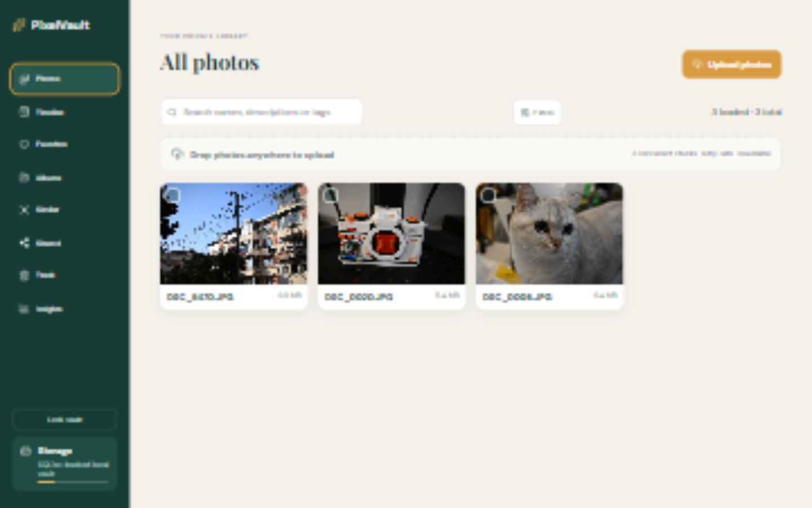

# PixelVault

English | [简体中文](README.zh-CN.md)

Self-hosted personal photo vault built with React, TypeScript, FastAPI and SQLite.



## Features

- Resumable concurrent photo uploads with automatic retry
- Albums, favorites, tags, timeline, search and batch organization
- Responsive gallery, full-resolution preview and slideshow
- Expiring photo and album share links
- Duplicate detection, Trash and restore
- Backup, restore and storage integrity maintenance
- Background thumbnail and EXIF processing

## Requirements

- Docker with Docker Compose for the recommended single-command setup, or
- Python 3.12+, Node.js 22+ and pnpm for local development

## Run with Docker (recommended)

```bash
copy .env.example .env
docker compose up --build
```

- Web: http://localhost:8080
- Health: http://localhost:8080/api/health
- Deployment, HTTPS, backup and rollback: `docs/production-deployment.md`

Replace `PIXELVAULT_PASSWORD` in `.env` before starting the application. The
Docker image builds the frontend and serves it together with the API, so no
local `node_modules/` or `dist/` directory is required.

## Run locally without Docker

Start the backend from the repository root in PowerShell:

```powershell
python -m venv .venv
.\.venv\Scripts\Activate.ps1
python -m pip install -r backend\requirements.txt
$env:PIXELVAULT_PASSWORD = "replace-with-a-long-random-password"
python -m uvicorn app.main:app --app-dir backend --host 127.0.0.1 --port 8000
```

In a second terminal, install and start the frontend:

```powershell
cd frontend
corepack enable
pnpm install --frozen-lockfile
pnpm dev
```

- Frontend development server: http://localhost:5173
- Backend health endpoint: http://localhost:8000/api/health
- Vite proxies `/api` requests to the local backend on port 8000.

## Frontend dependencies and build output

The repository commits the source files and reproducible dependency metadata,
not downloaded packages or generated build output:

- `frontend/package.json` defines the frontend dependencies and scripts.
- `frontend/pnpm-lock.yaml` pins the resolved dependency versions.
- `frontend/node_modules/` contains packages installed by pnpm. It is ignored by
  Git and recreated with `pnpm install --frozen-lockfile`.
- `frontend/dist/` contains the production HTML, CSS and JavaScript generated by
  Vite. It is ignored by Git and recreated with `pnpm build`.

Create and preview-check a production frontend build with:

```powershell
cd frontend
pnpm install --frozen-lockfile
pnpm build
```

The generated files appear in `frontend/dist/`. Production environments should
build these files from the committed source and lockfile instead of relying on a
developer's local build directory.

## Frontend structure

- `src/main.tsx` owns only session bootstrap and public/authenticated route selection.
- `src/pages` owns login, anonymous shares and authenticated vault composition.
- `src/components/layout` owns desktop/mobile navigation and the vault header.
- `src/components/library` owns filters, collection grids, batch controls, photo cards, details and confirmations.
- `src/components` contains independent backup, integrity, duplicate-review, insights and upload panels.
- `src/hooks/usePhotoLibrary.ts` owns filtered queries, pagination and processing polling.
- `src/hooks/useAlbums.ts` owns album collection loading.
- `src/hooks/useChunkedUpload.ts` owns the resumable concurrent upload state machine.
- `src/hooks/useVaultActions.ts` owns authenticated mutations, sharing and exports.
- `src/lib` and `src/types.ts` provide shared configuration, utilities and domain contracts.
- `packages/api-client` centralizes API URLs, credentials, JSON handling and errors. See `docs/api-client.md`.
