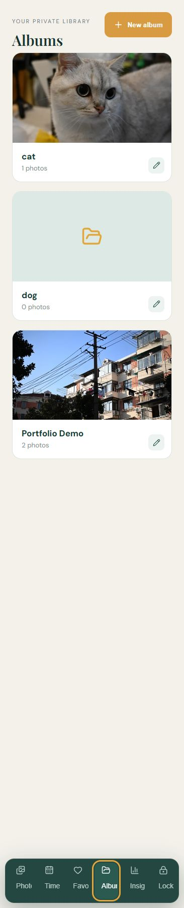
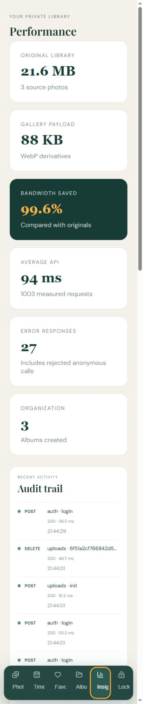
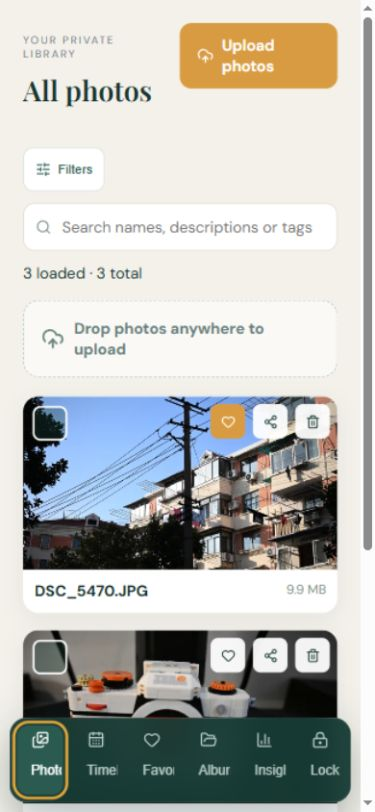
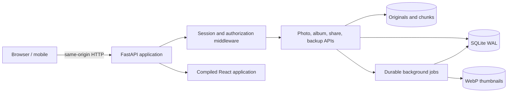
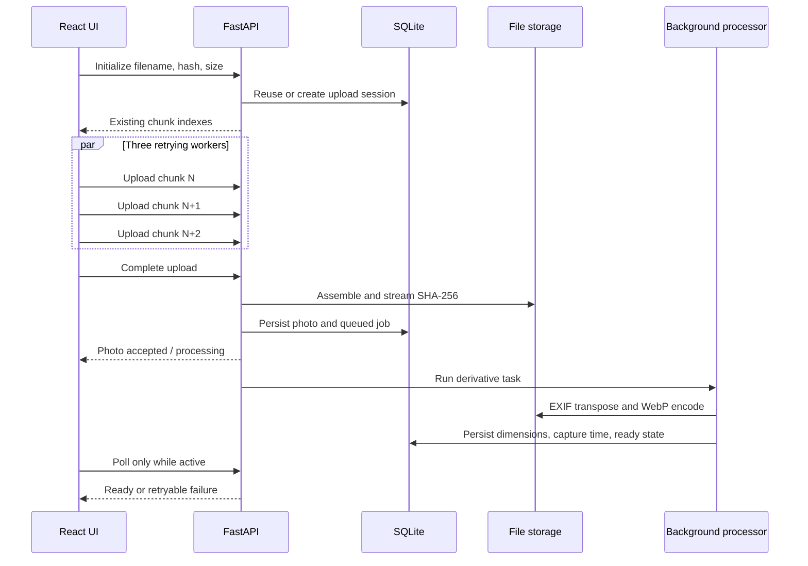

# PixelVault project showcase

## 30-second overview

PixelVault is a full-stack personal photo vault built with React, TypeScript, FastAPI and SQLite. It covers resumable concurrent uploads, SHA-256 deduplication, durable background image processing, relational albums, metadata search, expiring public shares, integrity verification, safe backup/restore and measurable performance optimization.


| Albums | Performance evidence | Mobile layout |
| --- | --- | --- |
|  |  |  |

The project is designed as engineering evidence rather than a UI-only demo: every important claim maps to executable tests, raw benchmark output or a concrete code path.

## Engineering highlights

| Capability | Engineering decision | Verifiable evidence |
| --- | --- | --- |
| Large-file upload | Persistent resumable sessions, 1 MiB chunks, three concurrent workers, retry backoff and final SHA-256 verification | `frontend/src/hooks/useChunkedUpload.ts`, `backend/smoke_test.py` |
| Background processing | Upload completion persists the original first; WebP and EXIF work runs through durable jobs with restart recovery and retry | `photo_processing_jobs`, processing API regression |
| Data model | Photos, albums, many-to-many membership, normalized tags, upload/auth/job records and bounded API events | `backend/app/db.py` |
| Safe deletion | Album unlink, global Trash and permanent deletion are separate operations with cross-album warnings | relationship and restore smoke tests |
| Reliability | Streamed SHA-256 integrity scans, missing derivative repair and orphan quarantine without deleting unknown originals | integrity job/repair regression |
| Privacy | Server-owned HttpOnly sessions, login throttling, expiring/revocable shares and member-scoped public album media | authentication/share regression |
| Performance | Reproducible concurrent workload; WAL, non-blocking auth checks and deferred/bounded audit writes | raw JSON plus performance report |
| Delivery | Production build, same-origin SPA/API entrypoint, non-root container, health checks and persistent storage | production verifier and deployment guide |

## Architecture



### Upload and processing lifecycle



## Measured result

The fixed local workload used 10-30 concurrent clients and four real photo records. All requests succeeded before and after optimization.

- Photo-list throughput: 5.24 to 33.35 req/s (6.36x)
- Thumbnail throughput: 4.94 to 34.50 req/s (6.98x)
- Mixed-read throughput: 4.58 to 18.41 req/s (4.02x)
- Mixed-read P95: 8149.90 ms to 2693.51 ms (66.9% reduction)
- Upload initialization: 3.51 to 7.11 req/s (2.03x)

These are local comparison results, not production-capacity claims. See `docs/performance-report.md` and the JSON files under `artifacts/performance` for the complete method and raw values.

## Verification map

```text
Frontend compile       npm run build
Business regression    cd backend && python smoke_test.py
Production entrypoint  python tools/verify_production.py
Performance workload   python -u backend/performance_test.py --scale 0.2 --output artifacts/performance/current.json
```

The smoke suite exercises authentication, filtering, albums, sharing, backup/restore, resumable sessions, metadata, duplicate handling, Trash, background processing and integrity repair against the live API.

## Honest boundaries

- The current data layer is SQLite plus local object storage, appropriate for a single-node personal vault. PostgreSQL/object storage are future scale options, not claimed current dependencies.
- The benchmark uses a small local data set and measures before/after behavior on one machine.
- Background work is durable at the job-state level but uses an in-process executor; a separate queue is the next step for multi-instance deployment.
- Docker configuration is included, but container execution was not verified on the development machine because its Windows version does not support the current Docker Desktop release.

## Suggested review order

1. Read this page and `docs/performance-report.md`.
2. Inspect `useChunkedUpload.ts`, `usePhotoLibrary.ts`, `backend/app/main.py` and `backend/app/db.py`.
3. Run the production verifier and smoke suite.
4. Review `docs/ai-development-log.md` for the requirement-decision-verification trail.
